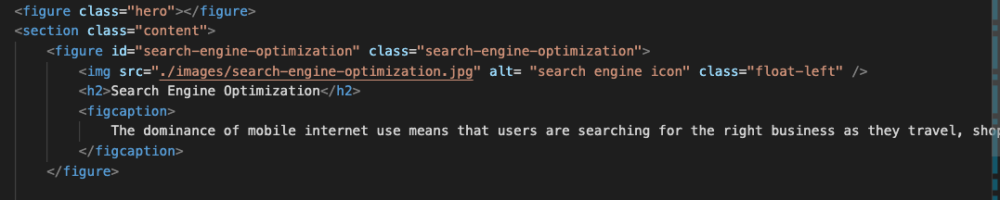
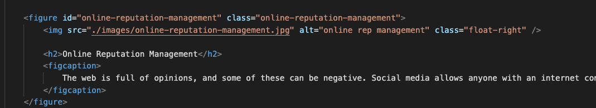
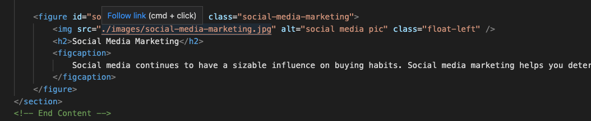
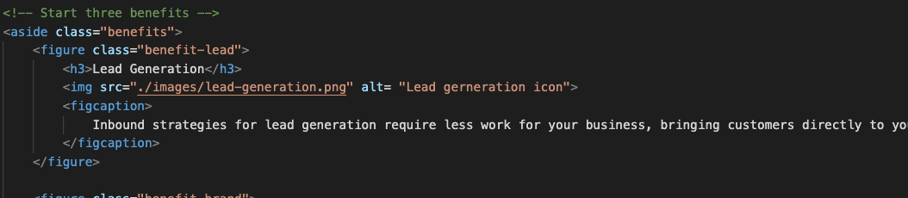
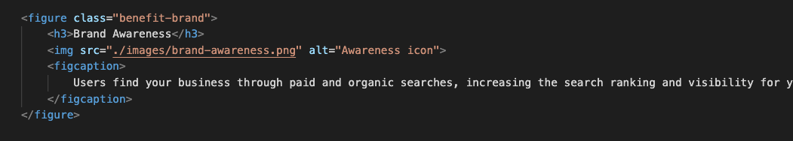
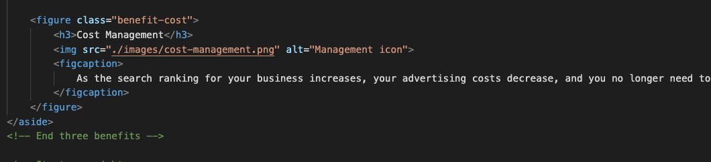
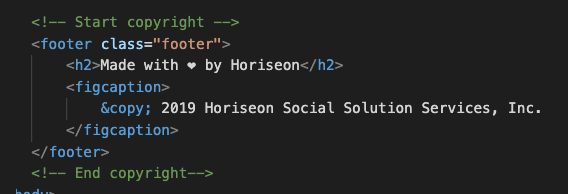

# Week-1

## Summary
Refactor the html and css. In the html I changed the div's into the coresponding section-- for example, head, body, header, nav, ul, li, figure, figure id, img, fig caption, and footer. Changed all the divs without runing the actual web. 

In the CSS I rearranged the sections to be more neat to look at and everything is under the right section. 

## Table of Contents
* [.hero](#header)
* [.nav](#navigationbar)
* [.content1](#searchengine)
* [.content2](#onlinerepuatation)
* [.content3](#socialmedia)
* [.benefits1](#leadgeneration)
* [.benefits2](#brandawareness)
* [.benefits3](#costmanagement)
* [.footer](#copyright)

## Header
"Horiseon" 

## Navigationbar
Search engine, online reputation, and social media. Can click and it will navigate to the coresponding paragraph. 

## .hero
The large backrground image

## .searchengine

## .onlinerepuatation

## .socialmedia

## .leadgeneration

## .brandawareness

## .costmanagement

## .copyright
